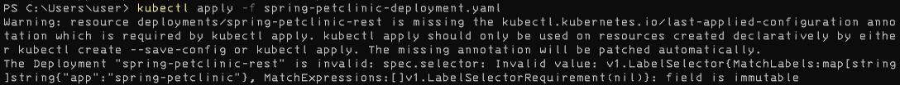

# advprog-module-11
 
## Hello Minikube Reflection
### 1. 
> Compare the application logs before and after you exposed it as a Service. 


> Try to open the app several times while the proxy into the Service is running.

> What do you see in the logs? Does the number of logs increase each time you open the app?

When the application is exposed as a service, it will show the logs whenever the application is accessed with GET.

### 2
> Notice that there are two versions of `kubectl get` invocation during this tutorial section.

> The first does not have any option, while the latter has `-n` option with value set to
`kube-system`.

> What is the purpose of the `-n` option and why did the output not list the pods/services that you
explicitly created?

The option `n` is used to determine namespace in Kubernetes cluster, which is used to allocate and organize resources in a cluster.

## Rolling Update & Kubernetes Manifest File Reflection
### 1
> What is the difference between Rolling Update and Recreate deployment strategy?

Rolling Update is a deployment strategy where the application is updated incrementally without any downtime, while recreate is a deployment strategy where the application is updated by stopping the old version and then starting the new version.

### 2
> Try deploying the Spring Petclinic REST using Recreate deployment strategy and document your attempt.

1. Starting


2. Creating deployment yaml
```yaml
apiVersion: apps/v1
kind: Deployment
metadata:
  name: spring-petclinic-rest
  labels:
    app: spring-petclinic
spec:
  replicas: 1
  strategy:
    type: Recreate
  selector:
    matchLabels:
      app: spring-petclinic
  template:
    metadata:
      labels:
        app: spring-petclinic
    spec:
      containers:
      - name: spring-petclinic-rest
        image: springcommunity/spring-petclinic-rest:2.4.2
        ports:
        - containerPort: 9966

```

3. Apply development


3. Creating service yaml
```yaml
apiVersion: v1
kind: Service
metadata:
  name: spring-petclinic-rest
spec:
  selector:
    app: spring-petclinic
  ports:
    - protocol: TCP
      port: 80
      targetPort: 9966
  type: LoadBalancer
```

4. Apply service


5. Running the service


### 3
> Prepare different manifest files for executing Recreate deployment strategy.

```yaml
apiVersion: v1
kind: Service
metadata:
  name: spring-petclinic-rest
spec:
  selector:
    app: spring-petclinic
  ports:
    - protocol: TCP
      port: 80
      targetPort: 9966
  type: LoadBalancer
```

### 4
> What do you think are the benefits of using Kubernetes manifest files? 

Using manifest file makes the development faster, there are version control, they are reproducible, and can be automated.

> Recall your experience in deploying the app manually and compare it to your experience when deploying the same app by applying the manifest files (i.e., invoking `kubectl apply -f` command) to the cluster

I'd prefer to use manifest instead of doing everything manually.